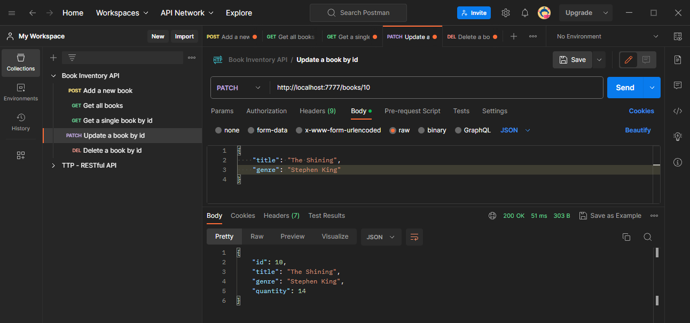

# Book Inventory API

A Book Inventory API built using Express and PostgreSQL that covers all CRUD operations. Testing was done with Postman.

## Book Inventory Schema

```sql
CREATE TABLE IF NOT EXISTS books (
    id SERIAL PRIMARY KEY,
    title VARCHAR(255) NOT NULL,
    genre VARCHAR(100) NOT NULL,
    quantity INTEGER NOT NULL
);
```

## CRUD Operations with Postman
### Creating a Book


### Reading All Books


### Reading a Single Book


### Updating a Book


### Deleting a Book
